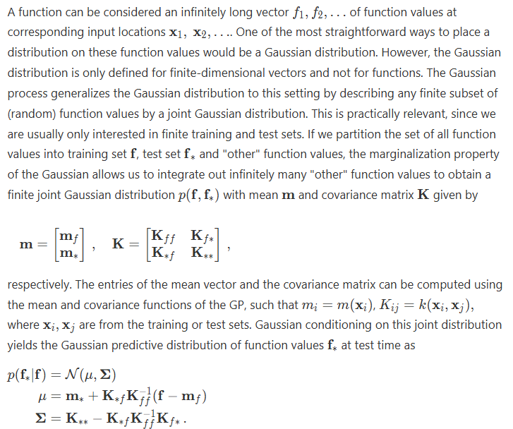

## Set Up

Load functions and packages. Read the standardized data and filter to province-level. Fill in age for rows where it is not specified.

As a first pass, we consider a subset of the data: Ontario, reported year 2023, 2-doses, for ages 5-17. Call this mini dataset `vax_ON`.

```{r}
#| label: setup

library(readr)
library(dplyr)
library(ggplot2)
library(tidyr)
library(stringr)
library(scales)
library(mnormt) # for multivariate normal
library(LaplacesDemon) # for logistic transform

invisible(lapply(list.files(here::here("R"), full.names = TRUE), source))  # load functions

#' read data
vax_raw <- readr::read_csv(here::here("data", "measles_vax-coverage-data.csv"), show_col_types = FALSE) |> filter(location %in% unique(pt_lookup()$location)) |> filter(pt!="CA") # filtering out sub-provinces etc and CA estimate
vax_schedule <- readr::read_csv(here::here("data", "measles_raw", "vax_schedule.csv"), show_col_types = FALSE)
popsize <- readr::read_csv(here::here("data", "popsize.csv"), show_col_types = FALSE)
current_year <- as.integer(format(Sys.Date(), "%Y")) # for ageing estimates
age_pre1970 <- current_year - 1969 # min age of those born strictly before 1970

#' prep data
vax_main  <- vax_raw %>%
  mutate(age = ifelse(is.na(age) & !is.na(year_report) & !is.na(year_birth), year_report - year_birth, age)) %>%  # calc age
  left_join(pt_lookup(), join_by(pt), suffix = c("", ".pt")) %>% filter(location == location.pt) %>% select(-location.pt)

vax_ON <- vax_main %>% filter(location=="Ontario") %>% filter(year_report==2023) %>% filter(n_doses %in% c("2"))  # *subset of doses for the toy model
```

> IP: This is a small point, but there are definitely questions about whether the ON data for younger ages is super trustworthy. I believe the data come from school administration data, and because of how these vaccines get reported to schools, there has been a bit of an interruption in that from the pandemic, which means that it's like the coverage estimates in ON for younger ages are artificially low. This is only relevant if we start to inform the model with other data that can help predict coverage; you may want to switch to the AB data in the future. LH: Agreed.

## A note on scales

Model fitting is done using Gaussian distributions, whose domain is the entire real line. However, the vaccine coverage data is restricted to $[0,1]$ (though in practice, they're not on the boundaries of this interval). Thus, we transform the vaccine coverage data using a logit function to map it from $(0,1)$ to $(-\infty, \infty)$, perform the model fitting on the real line, and then transform the predictions back from $(-\infty, \infty)$ to $(0,1)$.

## Define covariance function / covariance matrix

Use the squared exponential covariance function, `k`, to begin with and assume lengthscale `l=2`. Our dataset has 13 inputs/ independent variables (ages 5-17), so our covariance matrix is a 13x13 matrix defining the 'relationships' between each pair of ages.

> IP: What are the implications of using the square exponential covariance function? What kind of data would you expect to meet this assumption? What are the alternatives?\
> LH: Defaults/ reasonable first choices for covariance functions are the squared exponential, as well as exponential, rational quadratic (which is a sum of squared exponentials), and linear. (Note: using a linear covariance function collapses a GP to simply Bayesian linear regression). A squared exponential covariance function is generally a good first choice due to its smoothness, simplicity (only two params - distance r=\|x1-x2\| and lengthscale l), and good if you don't have much data. An exponential covariance function is generally more spiky / noisy. Another classic option is periodic but we do not have a periodic data in our case. The next level up from these standard covariance functions is then something like a 'Matern' covariance function which switches/ interpolates between exponential and squared exponential - apparently useful if the sq exp is giving something too smooth. Some websites I found helpful for further reading if interested: https://www.cs.toronto.edu/\~duvenaud/cookbook/ (a cookbook for covariance functions) / https://distill.pub/2019/visual-exploration-gaussian-processes/ (visual intro to GPs) / https://www.comsol.com/support/learning-center/article/more-on-covariance-functions-96531/271 (a useful paragraph on Matern below the plot). In answer to the question "what data is suitable for the squared exponential?", in our understanding there aren't many constraints. The general assumption is that nearby x points (e.g. ages) tend to be more correlated - this is driven by the lengthscale parameter l. \[\*\*\*If we aren't sure of this assumption, we could do some preliminary analysis to see if coverage for nearby ages is indeed more related than random - can discuss an idea for this.\] Generally a squared exponential (and exponential) are strictly decreasing functions where pairs of points with a distance close to 0 are the most related.\
> IP: this was very helpful, thanks! All good for now, I think, but worth keeping this note around.

```{r}
#| label: covariance

# ksqexp <- function(r,l) {  # this is also defined in ksqexp.R
#   exp(-r^2 / (2*l^2))
# }

xvals <- (vax_ON %>% mutate(age = pull_first(age)) %>% pull(age))  # a vector of ages (these x_i's are equally spaced)
npts <- length(xvals)
l <- 2
covmat <- expand_grid(x1=xvals,x2=xvals) %>% mutate(k=ksqexp(abs(x1-x2),l)) %>%  # evaluation of cov function pairwise for ages x1_i and x2_i (i=1,..,n)
  pull(k) %>% matrix(nrow=npts)
# could also use function generate_ksqexp_covmat() here
```

## Define prior distribution (N(0,cov)) and draw a sample

Define a prior \~ Normal(0,cov). It is uniquely defined with mean 0 and variance equal to our covariance matrix. Take 50 draws from the prior and plot. x_i is the vector of inputs (ages).

> IP: Since the mean is zero, is this a model for the *error*? Can you pls clarify what this is a prior of?\
> LH: No. This is a prior of the relationship between vaccine coverage and age (on the transformed \[-inf,inf\] scale). We are saying that transformed vaccine coverage follows a Gaussian Process (normal distributions) with mean 0, and variance `covmat`. Each curve is a draw from the prior (50 are shown as an example). From the prior plot below, we see roughly most of the draws lie between \[-2,2\] and have some smoothness. We can then play around with choice of covariance function to get priors which cover the space as we want. \[I believe the mean of 0 just comes about from a shift/scaling in equations - here is an explanation from the visual GP website: "In Gaussian processes it is often assumed that μ=0, which simplifies the necessary equations for conditioning. We can always assume such a distribution, even if μ≠0, and add μ back to the resulting function values after the prediction step. This process is also called *centering* of the data."\]\
> IP: Great. I think when we discussed this in our weekly meeting, I realized that this would amount to assuming a mean vaccine coverage of 50% (after undoing the logit transformation.) I see that we can adjust this with centering. A small note that we should be careful with the order of operations/working on the right scale between centering and transforming the data (feels like a small snare that we could fall into while developing the code).

```{r}
#| label: prior

prior <- tibble()
for(i in 1:50) {
  prior <- bind_rows(prior, tibble(draw=i, x_i=xvals, prior=rmnorm(1, rep(0,npts), covmat+1e-6*diag(npts))))  # each rmnorm is a random draw from the (multivariate) prior
}
prior %>% group_by(draw) %>% ggplot(aes(x=x_i,y=prior,group=factor(draw))) + scale_x_continuous(breaks=xvals) + geom_point(alpha=0.3) + geom_line(alpha=0.2)
```

## Introduce observed data

For this mini dataset `vax_ON` (Ontario, year 2023, 2-dose, ages 5-17), we have a complete dataset of 13 data points. First expose the model to 5 data points (to see how well it can predict the remainder). We will use the logistic transform of y (`logit(yobs)`) which maps from \[0,1\] to \[-inf,inf\].

```{r}
#| label: observe_data

# observe coverage data for age 6, 9, 11, 15, 16
xobs <- as.numeric(vax_ON %>% filter(age %in% c("6","9","11","15","16")) %>% pull(age))   # can optionally add an error term here
yobs <- vax_ON %>% filter(age %in% c("6","9","11","15","16")) %>% pull(value)

tibble(xobs, yobs, logit(yobs))
```

## Compute posterior distribution

The posterior is uniquely defined by its posterior mean and posterior covariance matrix. First, calculate individual covariance matrices to determine the pairwise 'relationships' between unobserved ages `xvals` and observed ages `xobs`. Then calculate the posterior covariance matrix as `kuu - kuo%*%solve(koo)%*%kou`.

> IP: can you either explain a bit more around the "calculation of individual covariance matrices to determine the pairwise 'relationships' between unobserved and observed ages"? I'm a little confused about how we're getting information about unobserved ages. Is it just from draws of the prior?\
> LH: We aren't getting any info. The covariance function is calculated using only the independent variable (age value, e.g. 5.0 and 6.0) and does not know the coverage at each age point. It's purely a measure of how related the items on the x-scale are to each other (as I understand). For the prior, we were calculating the covariance function between each pair of ages in `xvals` and `xvals`, and simply recording the value in one covariance *matrix*. Now for the posterior, we can make use of observed x-values too and instead have essentially four x matrices at our disposal (formally, these form the joint distribution between test points and training points). The four matrices are: `kuu` which is the covariance function calculated between each pair of ages in `xvals` and `xvals` (unobserved and unobserved) as in the prior; `kuo`, the cov fn between each pair of ages in `xvals` (unobserved) and `xobs` (observed); `kou`, the reverse; and finally, `koo`, the cov fn between each pair of ages in `xobs` and `xobs`. Again note that all of these calculations only measure items on the x-scale (no y's). We can then use *conditioning* to extract the posterior distribution (P(Xvals\|Xobs)) from the joint distribution (P(Xvals,Xobs)). The four matrices are used to calculate the final posterior mean and variance, following equations for the *conditional* distribution. See link below for further reading.\
> IP: Great, thanks. I think I'm starting to understand. The `kuu` matrix simply encodes how similar unobserved values are via the assumed covariance function. (That link below helped a ton!) Do you have notes somewhere deriving the equation for the posterior covariance matrix as a function of the `k` matrices?

> IP: Can you pls point me to some reading material and/or your notes where the posterior covariance matrix is derived? \
> LH: Nice visual website here https://distill.pub/2019/visual-exploration-gaussian-processes/ -- in the section on 'Marginalising and Conditioning', the conditioning X\|Y expression is described. Much further down, there is also a section on 'Posterior distribution'.\
> IP: Doing some [further reading](https://infallible-thompson-49de36.netlify.app/), I came across the derivation I was looking for:\
> \
> 

> LH: A valid follow-on question could be "if all of this uses only information about the x-values, how do we estimate vaccination coverage?". Once we have generated a posterior curve (or technically distribution of curves), we can make use of the smoothness to estimate vaccine coverage at points not observed from the observed points (i.e. same concept as regression).\
> IP: Makes sense, thanks!

```{r}
#| label: posterior

kuo <- generate_ksqexp_covmat(xvals,xobs,fn=ksqexp,l=l)  # 'relationship' pairwise between unobserved and observed ages
kou <- generate_ksqexp_covmat(xobs,xvals,fn=ksqexp,l=l)  # 'relationship' pairwise between  observed and unobserved ages
koo <- generate_ksqexp_covmat(xobs,xobs,fn=ksqexp,l=l) + 1e-6*diag(length(xobs))  # protect against non-invertibleness
kuu <- generate_ksqexp_covmat(xvals,xvals,fn=ksqexp,l=l)

# calcuate posterior mean and posterior cov matrix
post_mean <- kuo%*%solve(koo)%*%(logit(yobs))  # conditional mean
post_covmat <- kuu - (kuo%*%solve(koo)%*%kou)  # conditional variance
```

## Plot posterior against the data

Take 50 draws from the posterior and plot against the observed logit-transformed data. The posterior function can be used to provide estimates of our missing coverage data if inverse-transformed back to a \[0,1\] interval (second plot).

```{r}
#| label: plot_posterior

post <- tibble()
for(i in 1:50) {  # take 50 posterior draws
  post <- bind_rows(post, tibble(draw=i, x_i=xvals, post=rmnorm(1, post_mean, post_covmat + 1e-6*diag(nrow(post_covmat)))))  # each rmnorm is a random draw from the (multivariate) posterior
}
post <- post %>% mutate(post_constrained=invlogit(post))  # add column to transform back to [0,1] interval

post %>% ggplot() + geom_point(aes(x=x_i,y=post,group=factor(draw)), alpha=0.3) + scale_x_continuous(breaks=xvals) + geom_line(aes(x=x_i,y=post,group=factor(draw)), alpha=0.2) + geom_point(data=tibble(x=xobs, y=logit(yobs)), aes(x=x,y=y), col="red")

post %>% ggplot() + geom_point(aes(x=x_i,y=post_constrained,group=factor(draw)), alpha=0.3) + scale_x_continuous(breaks=xvals) + scale_y_continuous(limits=c(0,1)) + geom_line(aes(x=x_i,y=post_constrained,group=factor(draw)), alpha=0.2) + geom_point(data=tibble(x=xobs, y=yobs), aes(x=x,y=y), col="red")
```

We can add in the remaining true data (which the model has not seen) to evaluate its performance. The true coverage values are marked as red (seen) and green (not seen) points.

```{r}
#| label: compare_to_data
post %>% ggplot() + geom_point(aes(x=x_i,y=post_constrained,group=factor(draw)), alpha=0.3) + scale_x_continuous(name="age x_i", breaks=xvals) + scale_y_continuous(limits=c(0,1)) + geom_line(aes(x=x_i,y=post_constrained,group=factor(draw)), alpha=0.2) + geom_point(data=tibble(x=xvals, y=(vax_ON %>% pull(value))), aes(x=x,y=y), col="green") + geom_point(data=tibble(x=xobs, y=yobs), aes(x=x,y=y), col="red")
ggsave(paste0("plots/toy-post_l",l,"_ksqexp",".pdf"), height=4.51, width=7.29)
```

## Extensions

To improve this toy model, the next step would be to experiment with choice of covariance function `k` and lengthscale `l`.

We could then extend to a larger portion of the dataset by adding a second dimension (e.g. year). Geometrically, this would move from a posterior curve as on the above plot, to a posterior *surface* in a 3d plot / cube. We would also want to add a dimension for province, giving a posterior hypersurface in a 4d hypercube... The final model would aim to produce separate hypersurfaces for 1-dose, 1+-dose, and 2-dose. Geometry aside, this just equates to providing an estimate of coverage at each combination of age, year, province, and dose.

Here is an example of adding in year_report as a dimension (only prior is shown):

```{r}
#| label: prior_surface

# setup
vax_ON2 <- vax_main %>% filter(location=="Ontario") %>% filter(n_doses %in% c("2","2+"))  # toy dataset
# now both x and y are inputs, with output z
xvals <- vax_ON2 %>% mutate(age = pull_first(age)) %>% pull(age) %>% unique() %>% sort()  # a vector of ages
yvals <- vax_ON2 %>% pull(year_report) %>% unique() %>% sort()  # a vector of year_report
npts <- length(xvals)*length(yvals)
l1 <- 1.5  # x lengthscale
l2 <- 1  # relative lengthscale of x values to y values
yvals <- yvals*l2  # scale y values to the x lengthscale

# prior
covmat <- expand_grid(x1=xvals, y1=yvals, x2=xvals, y2=yvals) %>% mutate(k=ksqexp(sqrt((x1-x2)^2 + (y1-y2)^2), l1)) %>%
  pull(k) %>% matrix(nrow=npts)

xydf <- expand_grid(x=xvals, y=yvals)
prior2 <- tibble() 
for(i in 1:1){  # a single realisation from a 2D gaussian process, with both x, y axes independent variables - one draw from the prior
  prior2 <- bind_rows(prior2, tibble(draw=i, x_i=xydf$x, y_i=xydf$y, prior2=rmnorm(1, rep(0,npts), covmat + 1e-6*diag(npts))))
}

prior2 %>% ggplot(aes(x=x_i, y=y_i, z=prior2, group=factor(draw))) + scale_x_continuous(breaks=xvals) + geom_contour(alpha=0.3)
```

> IP: Overall, this is a great first start! I would be hesitant to push the lengthscale too far because I think vaccine coverage by cohort is fairly localized to that cohort. I'd like to think a bit more about the implications of the covariance function `k` and if we can better-inform it with some additional info to help predict for missing ages.
